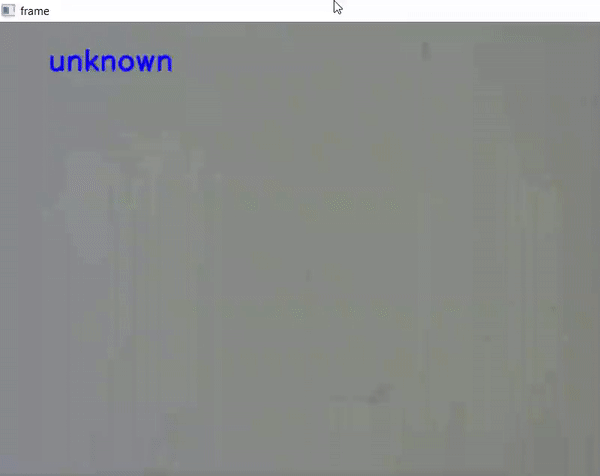

# Food Classification using TensorFlow
A repository for food classification demo.
<!--Images-->

## Data Collection and Training

 Using [Google Teachable Machine](https://teachablemachine.withgoogle.com/) to record image dataset and train.

Basically, there is two deep learning models:

1. Model 1 : Detect presence of food (Yes/No), I collected image datasets consisting of 2 classes. The first class is images of background without food such as empty table surface.

1. Model 2 : Food classification (Multi-class Classification), I collected around 500 images per food class.

Can download trained model from the website, saved as Keras model or SavedModel.
## Live Demo
Used following Python packages, to run on my laptop.
```
cv2
tensorflow
numpy
```

## Video

https://www.youtube.com/watch?v=qU5ZYXuYz6I